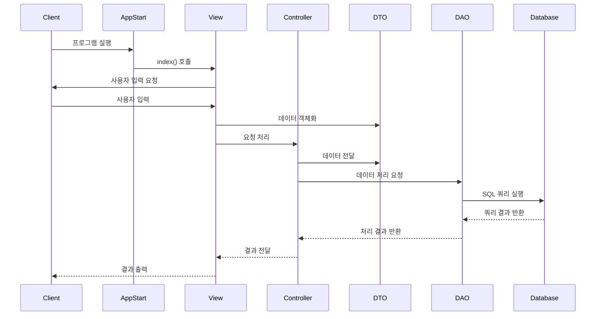

```mermaid
sequenceDiagram
    participant Client
    participant AppStart
    participant View
    participant Controller
    participant DTO
    participant DAO
    participant Database
    Client ->> AppStart: 프로그램 실행
    AppStart ->> View: index() 호출
    View ->> Client: 사용자 입력 요청
    Client ->> View: 사용자 입력
    View ->> DTO: 데이터 객체화
    View ->> Controller: 요청 처리
    Controller ->> DTO: 데이터 전달
    Controller ->> DAO: 데이터 처리 요청
    DAO ->> Database: SQL 쿼리 실행
    Database -->> DAO: 쿼리 결과 반환
    DAO -->> Controller: 처리 결과 반환
    Controller -->> View: 결과 전달
    View -->> Client: 결과 출력
```